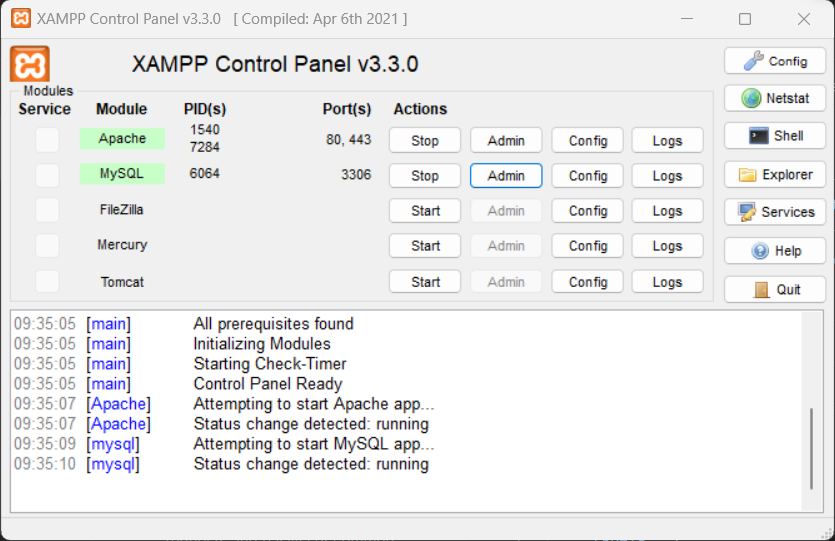
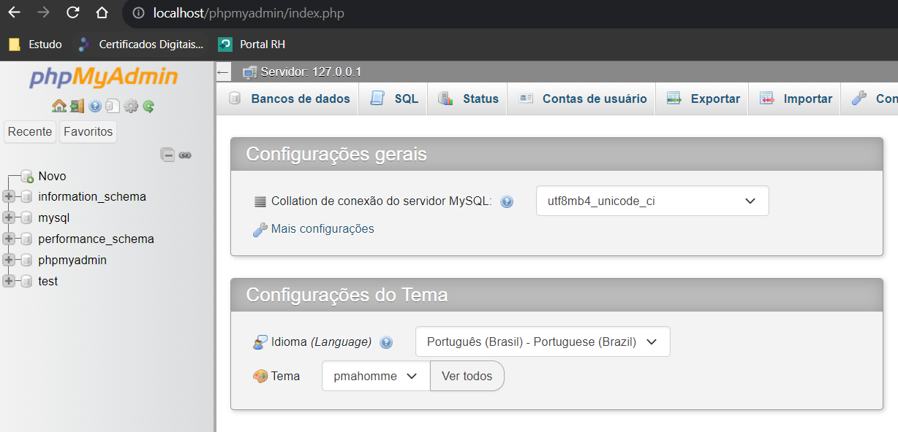
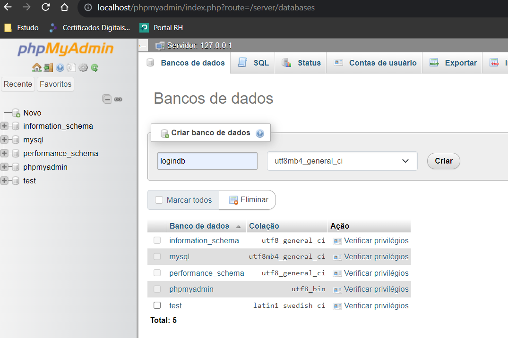
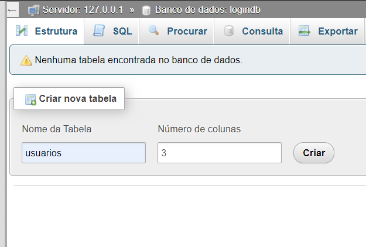
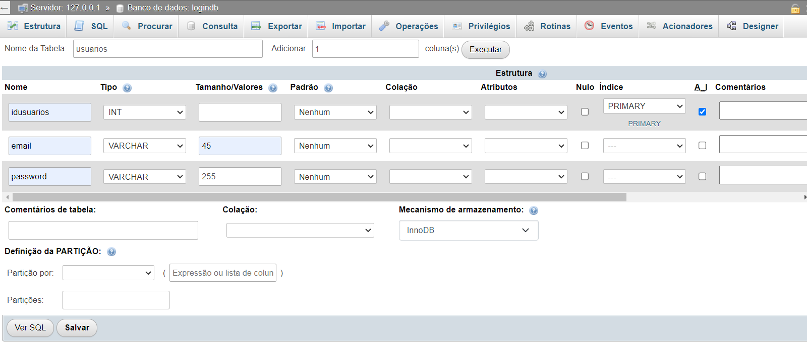
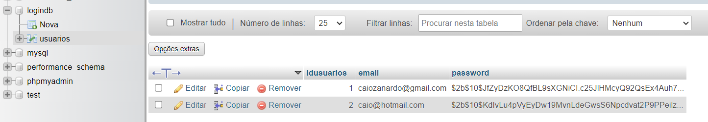
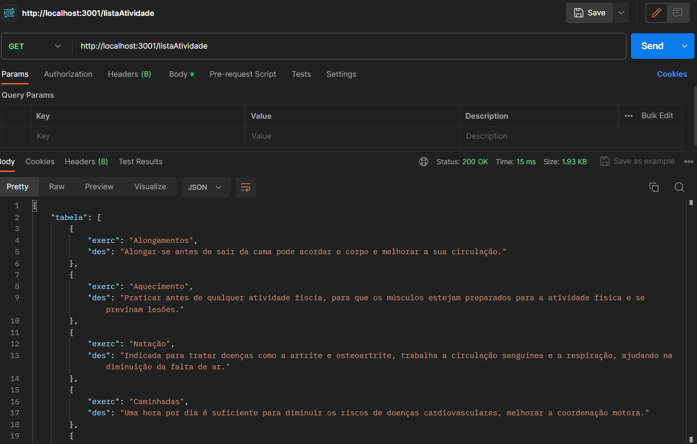

# Conteúdo criado para Global Solution de DIGITAL EXPERIENCE PLATAFORM(BackEnd) + OPTIMIZATION-TECHNOLOGY(FrontEnd) + CYBER SECURITY DEVOPS

### Banco de Dados

- No Xampp iniciar:
  - Apache;
  - Mysql;
    - Clicando em admin no "Mysql" abre a console;

- Criar Banco "logindb";
 - Clicar em novo;
  

- Criar Tabela "usuarios";
- são 3 colunas;
 

- Inserir 3 atributos
  - idusuarios:
    - Deixar como INT, selecionar A_I(Auto increment) no automático será a chave primária;
  - email:
    - Varchar 45;
  - password:
    - Varchar 255 pois temos uma função de criptografia para não gravar a senha exposta;

### Bibliotecas utilizadas no projeto

- express;
- mysql;
- cors;
- bcrypt;

- #### Instalação: 
   - npm install express mysql cors bcrypt

### Backend

- no diretório "api" utilizar o npm start para iniciar a aplicação;
- /register funcionalidade criada para ser utilizado pelo front para cadastrar um usuário;
- /login funcionalidade criada para ser utilizado pelo front;
- /listaAtividade retorna a lista de atividades:
  - Via front é exibida após usuário cadastrado se autenticar;
  - Pode ser chamada via postman para obter o resultado:
    - Metodo: Get
    - URL: http://localhost:3001/listaAtividade
   

### GitActions

- Criado para validar se aplicação está funcionando! Validando o retorno do json no path:
  - http://localhost:3001/listaAtividade

### Frontend

- https://github.com/CaioZanardo/GlobalSolution-Optimization
  
## Grupo

- André Spinelli Cintra RM 551016
- Augusto de Oliveira Laurino RM 93498
- Caio Felipe Britto Zanardo da Silva RM 95125
- Gabriel Wilke Azevedo RM 95211
- Guilherme de Lucas Garcia RM 94392
